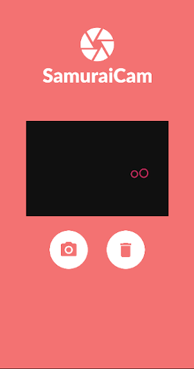

## Dev Samurai - React Native Tutorials: Usando a Câmera do Celular

Esse projeto foi desenvolvido como exemplo para a série de tutoriais sobre React Native da Dev Samurai.

O projeto consiste em uma aplicação simples que permite a captura de fotos através da câmera do celular utilizando a lib react-native-camera e a visualização da foto tirada.

O foco principal é na instalação, configuração e utilização básica da câmera do celular com React Native para Android e IOS.

Então essa aplicação é apenas uma demo para ilustrar o conceito, você pode acompanhar o tutorial completo em: https://devsamurai.com.br/react-native-camera/

### Dúvidas

Ficaremos felizes em ter você em nossa comunidade no Discord:

Caso você tenha alguma dúvida sobre o tutorial ou estiver com erros no código acesse nossa comunidade no Discord: https://lp.devsamurai.com.br/discord

Ficaremos felizes em te ajudar ;)

## Créditos

Esse conteúdo foi planejado e produzido pela equipe Dev Samurai e está aberto ao público para visualização e utilização para aprendizado e conhecimento.
